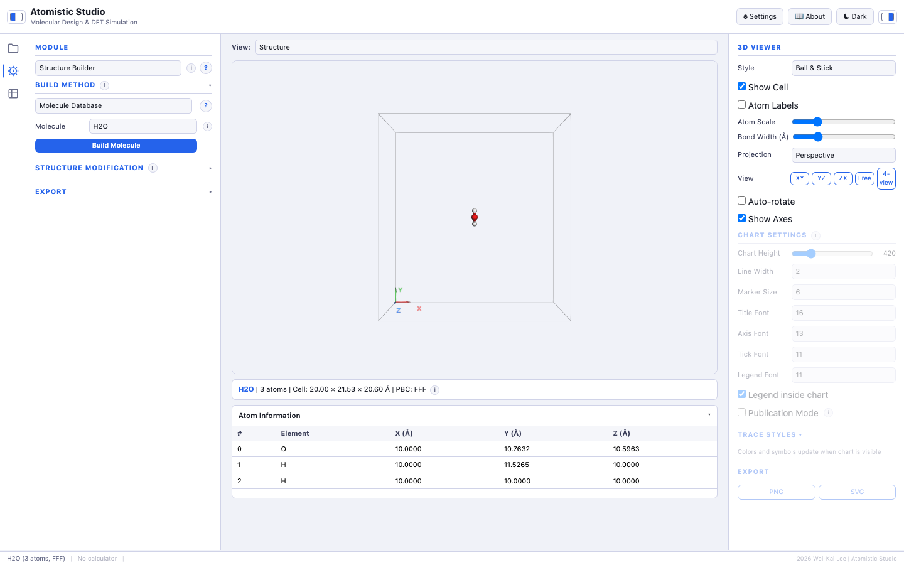
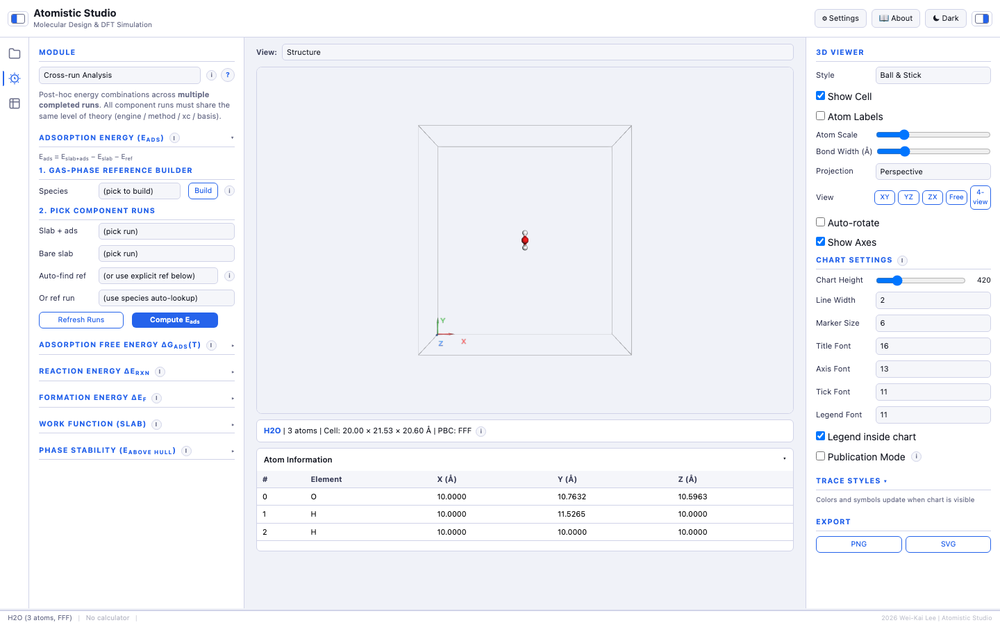
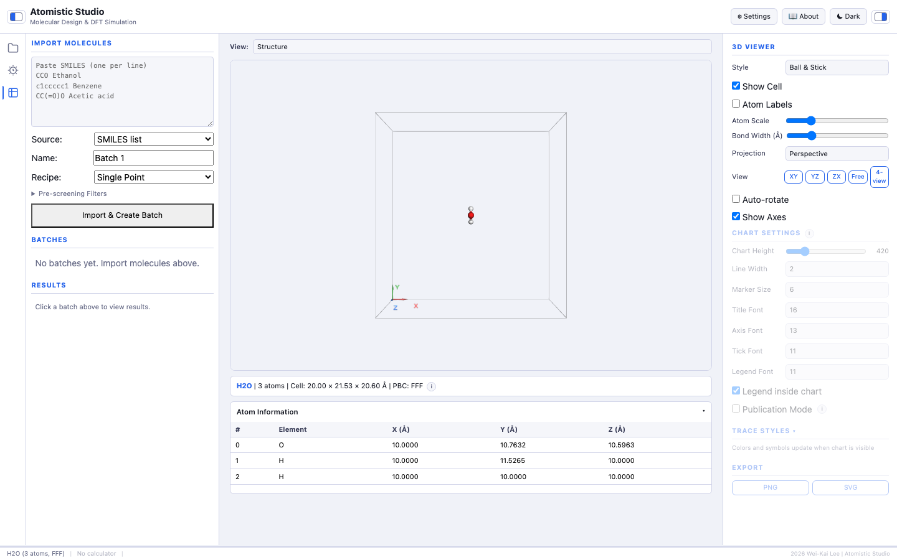
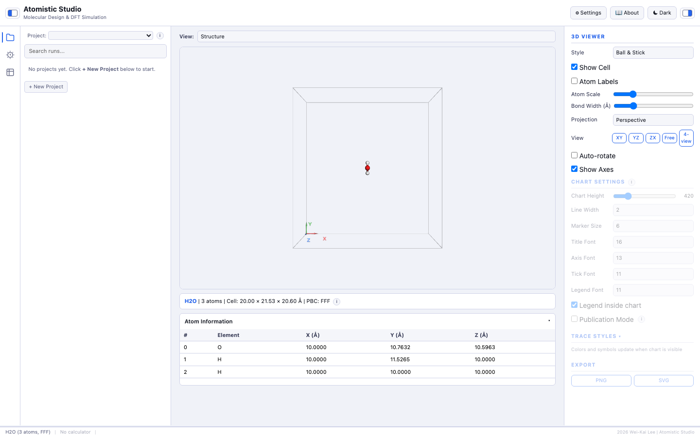

# AtomisticStudio

[Back to portfolio](../../README.md)

AtomisticStudio, documented upstream as ASE Simulation Studio, is a browser-based research workbench for atomistic simulation workflows built on the [Atomic Simulation Environment (ASE)](https://wiki.fysik.dtu.dk/ase/). It brings structure building, calculator setup, DFT and quantum chemistry runs, molecular dynamics, cross-run analysis, visualization, plotting, and SQLite-backed provenance into one local web UI.

## Portfolio Summary

| Item | Summary |
|---|---|
| Domain | Atomistic simulation, computational chemistry, materials modeling |
| Target users | Researchers and students who want a GUI-driven path through ASE-based workflows |
| Main value | Turns fragmented script-based modeling tasks into a browser workflow with saved provenance, reusable runs, and cross-run analysis |
| Stack | Flask, vanilla JavaScript, Bootstrap CSS, SQLite, 3Dmol.js, Plotly.js, ASE, RDKit, PySCF, optional GPAW/VASP/QE/LAMMPS/MACE |
| Public-safe version | Source code, install commands, local runtime paths, and detailed implementation layout are omitted |

## Runtime UI

### Structure Builder

The main workflow starts with a browser Structure Builder. It supports SMILES input, the ASE molecule database, bulk crystals, slabs, nanotubes, uploads, supercells, adsorbates, cell editing, and structure export.

### Cross-run Analysis

Cross-run Analysis combines completed calculations while checking that component runs use compatible levels of theory.

| Analysis | Purpose |
|---|---|
| Adsorption energy | `E_ads = E_slab+ads - E_slab - E_ref`, with gas-phase reference lookup |
| Adsorption free energy | `dG_ads(T)` from slab+ads, slab, and gas-reference thermochemistry runs |
| Reaction energy | Stoichiometric `dE_rxn` from saved reactant and product runs |
| Formation energy | Compound energy relative to elemental reference runs |
| Phase stability | Unary and binary `E_above_hull` reports with CSV export |
| Work function | GPAW slab `W = E_vac - E_F` from planar-averaged potential |

### Batch Screening

Batch Screening accepts SMILES lists or CSV input, applies optional molecular filters, and queues many single-point, optimization, or property calculations.

### Data Panel

The Data Panel organizes projects, molecules, conformers, runs, tags, notes, comparison views, artifacts, and exports.

## Supported Workflows

| Workflow | Summary |
|---|---|
| Molecular quantum chemistry | Build molecules from SMILES or the ASE molecule database, generate RDKit conformers, apply PySCF presets, run optimization, vibrations, thermochemistry, TD-DFT, UV-Vis, HOMO/LUMO, and descriptors |
| Catalysis and surface science | Build slabs, add adsorbates, save slab/slab+adsorbate/gas-reference runs, compute `E_ads` or `dG_ads(T)`, and extend with NEB, dimer searches, or work-function analysis |
| Bulk materials | Build or import periodic crystals, run EOS, elastic constants, band structure, DOS, phonons, formation energy, and phase-stability comparisons |

## Feature Map

| Area | Current features |
|---|---|
| Structure building | SMILES, molecule database, bulk crystal, surface/slab, nanotube, upload, supercell, adsorbate, cell editing |
| Calculators | EMT, GPAW, VASP, Quantum ESPRESSO, LAMMPS, MACE-MP, PySCF |
| Presets | Molecular fast screen, molecular publication, correlated QC, catalysis slab, catalysis NEB, bulk materials, semiconductor band gap |
| Optimization | Single point, BFGS, LBFGS, FIRE, MDMin, optional cell relaxation, convergence warnings |
| Dynamics | NVE, NVT Langevin, NVT Nose-Hoover, NPT |
| Electronic structure | EOS, Birch-Murnaghan fit, elastic constants, band structure, DOS |
| Vibrations and spectra | Vibrational analysis, IR spectrum, phonon dispersion, TD-DFT/TDA, UV-Vis |
| Thermochemistry | Ideal gas and harmonic models over temperature ranges |
| Molecular informatics | RDKit descriptors, fingerprints, Lipinski/QED, Tanimoto similarity, conformer ranking |
| Batch work | SMILES/CSV import, pre-screen filters, sequential batch execution |
| Persistence | SQLite projects, molecules, runs, artifacts, notes, tags, search, comparison, CSV/JSON export |

## Key Highlights

| Highlight | Why it matters |
|---|---|
| Full browser workbench | Structure setup, simulation, plots, and saved runs sit in one inspectable UI |
| Cross-run scientific analysis | Adsorption, free energy, reaction, formation, phase-stability, and work-function helpers reuse completed calculations instead of detached spreadsheets |
| SQLite-backed provenance | Projects, molecules, runs, settings, summaries, and artifacts can be searched and reused |
| Batch screening | Molecular lists can be filtered and queued through repeatable calculation workflows |
| Scientific guardrails | Warnings and presets help reduce plausible-looking but methodologically unsafe results |

## Vibe Coding Notes

The updated README shows the project moving from a broad ASE wrapper into a more complete research workbench. The major leap is Cross-run Analysis: saved calculations are no longer isolated outputs, but reusable building blocks for adsorption energies, free energies, reactions, formation energies, phase stability, and work functions.

The current portfolio version emphasizes the live UI screenshots, workflow coverage, data provenance, and scientific safety posture while avoiding source code, setup commands, and local machine details.

## Public Version Adjustments

- Removed command-line setup instructions and detailed source layout from the original README.
- Kept the scientific scope, workflow map, live UI screenshots, and analysis helpers.
- Copied the README screenshots into `assets/` and rewrote image links as relative paths.
