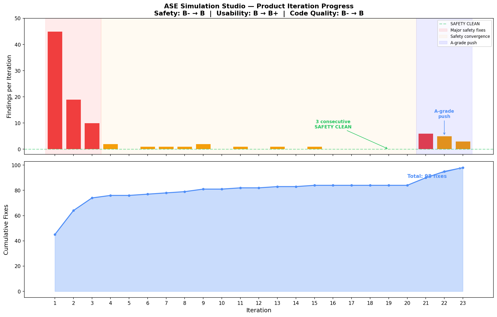

# AtomisticStudio

[Back to portfolio](../../README.md)

AtomisticStudio is a browser-based research workbench for atomistic simulations built around the Atomic Simulation Environment (ASE). It brings molecule/crystal construction, calculator setup, simulation execution, visualization, and result management into one web UI.

## Portfolio Summary

| Item | Summary |
|---|---|
| Domain | Atomistic simulation, computational chemistry, materials modeling |
| Target users | Researchers and students who want a GUI-driven path through ASE-based workflows |
| Main value | Turns fragmented script-based modeling tasks into a browser workflow with provenance and reusable runs |
| Stack | Flask, vanilla JavaScript, SQLite, 3Dmol.js, Plotly.js, ASE, PySCF, RDKit |
| Public-safe version | Source code, install commands, local runtime paths, and detailed file tree were omitted |

## What It Does

AtomisticStudio covers a wide range of atomistic workflows:

- Structure building for molecules, bulk crystals, surfaces/slabs, nanotubes, adsorbates, uploaded structures, and supercells.
- Calculator setup for EMT, GPAW, VASP, Quantum ESPRESSO, LAMMPS, MACE, and PySCF workflows.
- Geometry optimization, molecular dynamics, single-point energy, equation-of-state, DOS, band structure, vibration, phonon, thermochemistry, transition-state, and excited-state workflows.
- RDKit-backed descriptors, fingerprints, conformer generation, and batch screening.
- SQLite-backed run persistence with saved settings, artifacts, project grouping, search, comparison, and CSV/JSON export.

## Key Highlights

| Highlight | Why it matters |
|---|---|
| 3D browser workbench | Makes molecular and materials workflows easier to inspect without leaving the UI |
| Provenance-first data model | Saves calculation inputs, settings, outputs, and artifacts for later comparison |
| Domain safety improvements | Added warnings for open-shell systems, low-temperature thermochemistry, inappropriate EMT usage, slab constraints, and convergence issues |
| Research workflow presets | Encodes common molecular QC, catalysis, and materials-discovery settings as selectable workflows |
| Iterative AI review loop | The project includes evidence of autonomous review cycles that pushed the tool from demo toward lab-grade workflows |

## Vibe Coding Notes

The project grew through repeated domain-review cycles rather than a single linear implementation. Later iterations added open-shell spin inference, slab fixing, adsorption-energy bookkeeping, elastic constants, raw engine log persistence, convergence warnings, and domain presets.

The most interesting vibe-coding result is not only the UI breadth, but the review discipline: the project used domain-specific safety checks to catch cases where a simulation could produce plausible-looking but scientifically wrong output.

## Public Version Adjustments

- Removed original source tree details and command-line startup instructions.
- Kept the scientific scope, calculator coverage, data-management model, and autonomous iteration story.
- Copied only documentation images into `assets/`.

