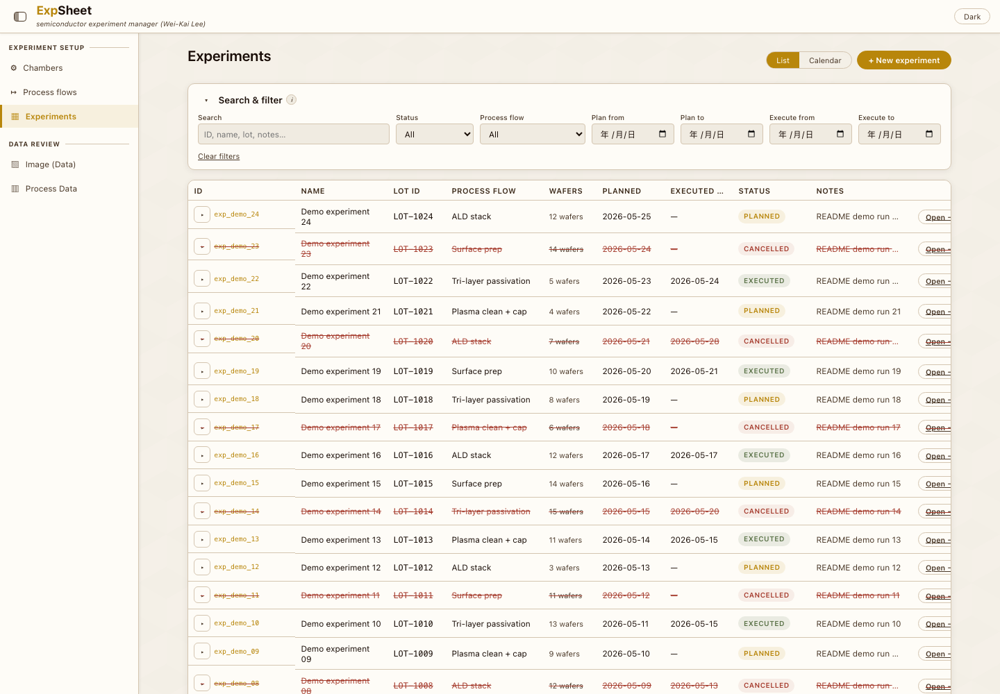
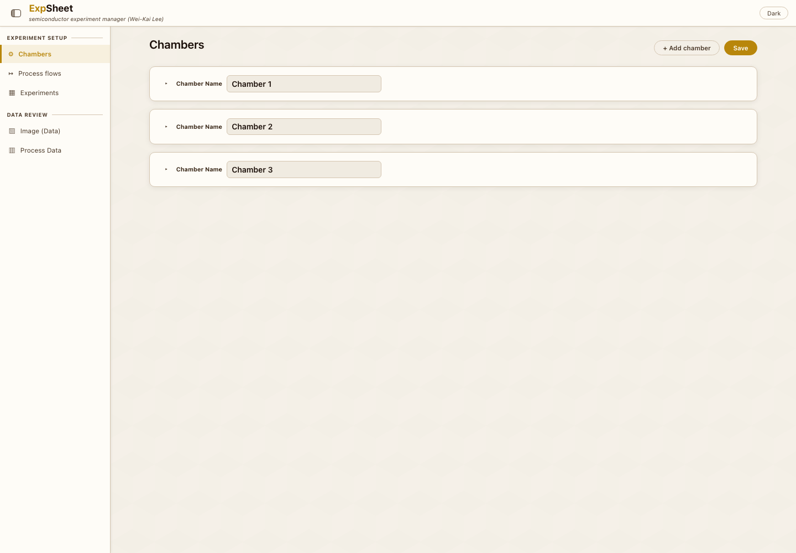
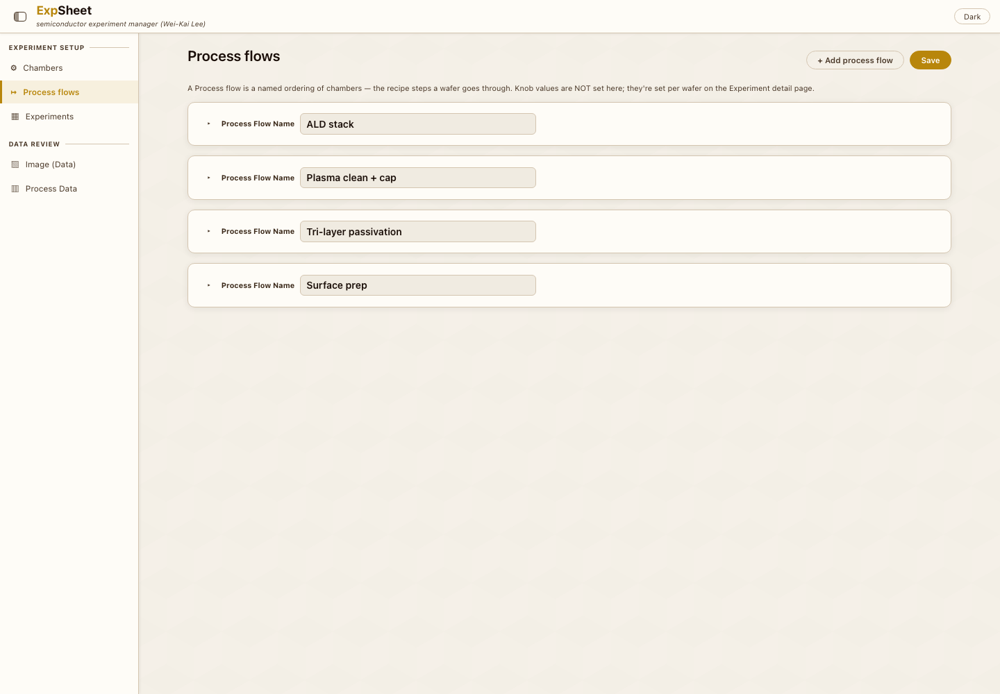
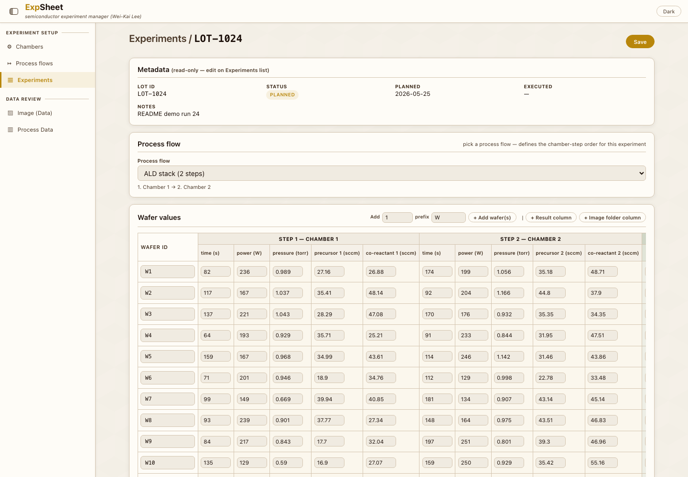
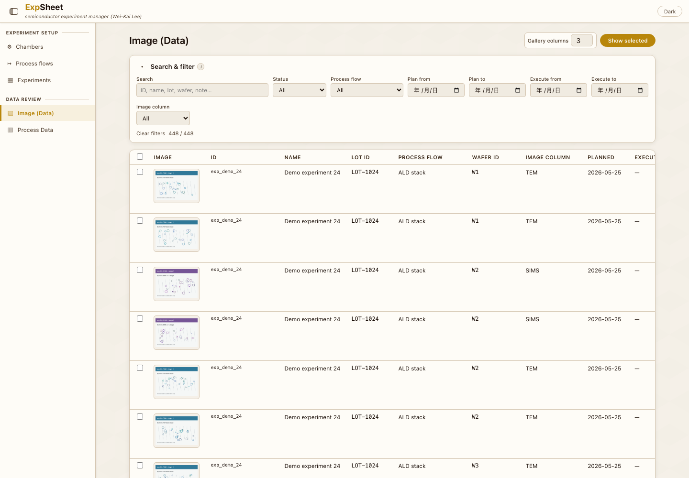
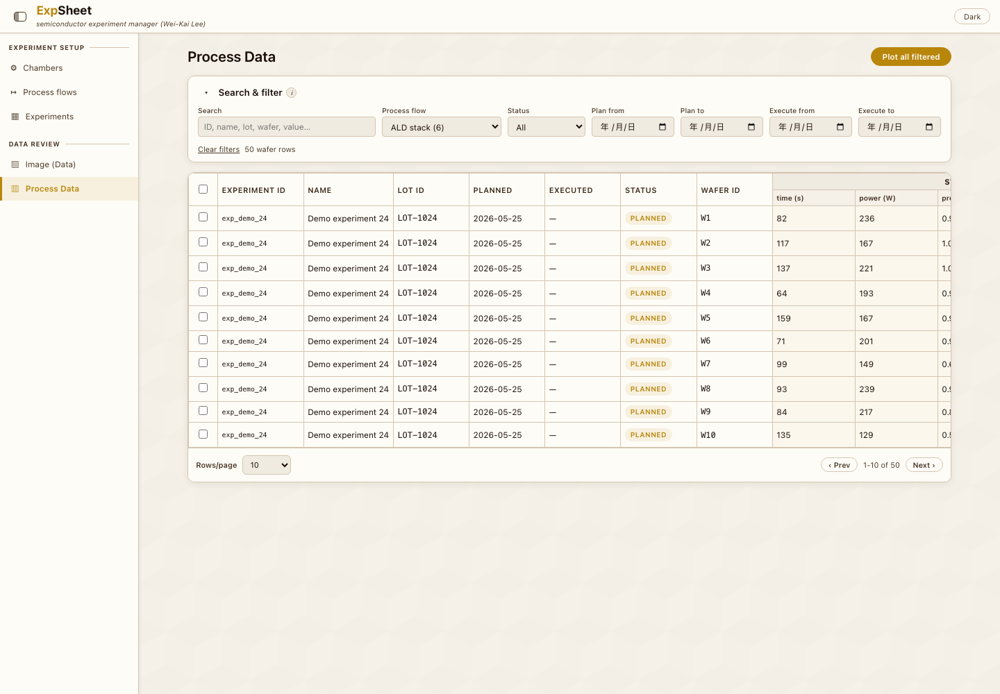
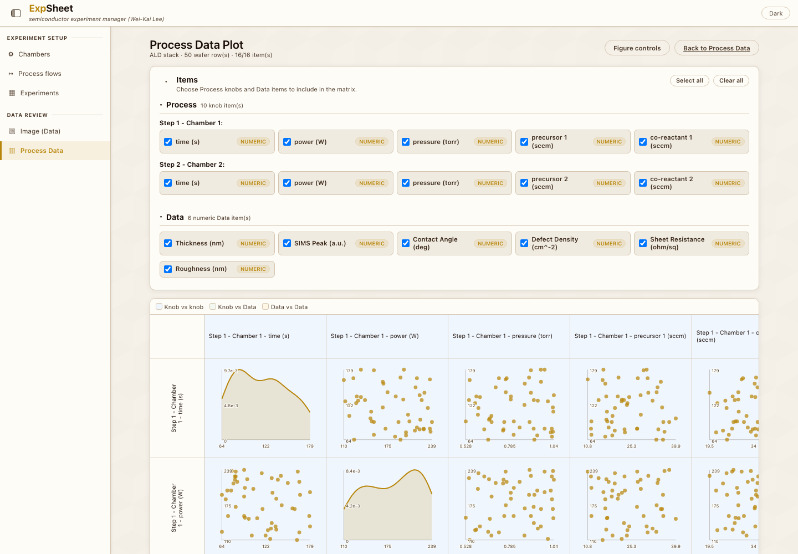

# ExpSheet

[Back to portfolio](../../README.md)

ExpSheet is a local-first semiconductor experiment manager. It helps define process chambers, combine them into process flows, record wafer-level experiment data, and compare images or process values across many experiments.

## Portfolio Summary

| Item | Summary |
|---|---|
| Domain | Semiconductor experiment tracking and process comparison |
| Target users | Researchers managing local wafer/process experiment records |
| Main value | Provides a lightweight local alternative to spreadsheets for process flow and wafer-level data review |
| Stack | Flask web UI, plain JSON storage, local image-folder references |
| Public-safe version | Local data paths, runtime commands, and privacy-check commands were reduced |

## What It Does

ExpSheet follows this workflow:

| Step | Purpose |
|---|---|
| Chambers | Define process tools and their knobs, units, defaults, and limits |
| Process flows | Combine chambers into ordered recipe templates |
| Experiments | Record metadata, dates, wafer counts, process values, measurement columns, and image-folder references |
| Image Data | Compare image rows across experiments by image type, wafer, status, flow, and notes |
| Process Data | Merge wafer rows from experiments sharing the same process flow for table and plot review |

## Screenshots

| Chambers | Process Flows |
|---|---|
|  |  |

| Experiment Detail | Image Data |
|---|---|
|  |  |

| Process Data | Process Data Plot |
|---|---|
|  |  |

## Key Highlights

| Highlight | Why it matters |
|---|---|
| Local-only model | Designed to run on loopback and keep experiment data off cloud services |
| No database dependency | Uses JSON files and local image references for small-lab simplicity |
| Same-flow comparison | Process Data merges comparable wafer rows without opening each experiment one by one |
| Image review workflow | Image Data makes visual inspection across many experiments faster |
| Plot matrix | Numeric and categorical process variables can be compared across selected wafers |

## Vibe Coding Notes

ExpSheet is a good example of focused product design for a narrow research workflow. Instead of building a broad LIMS, the tool concentrates on chamber definitions, process-flow reuse, experiment records, and comparison views that answer practical lab questions quickly.

## Public Version Adjustments

- Removed machine-specific local paths and command-line privacy checks.
- Kept the local-first privacy posture and feature workflow.
- Copied only README documentation screenshots into `assets/`.

