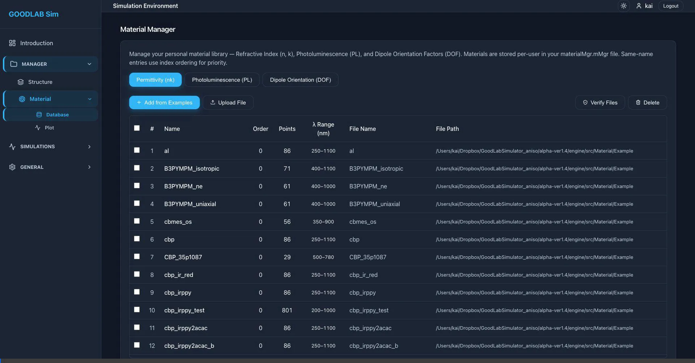
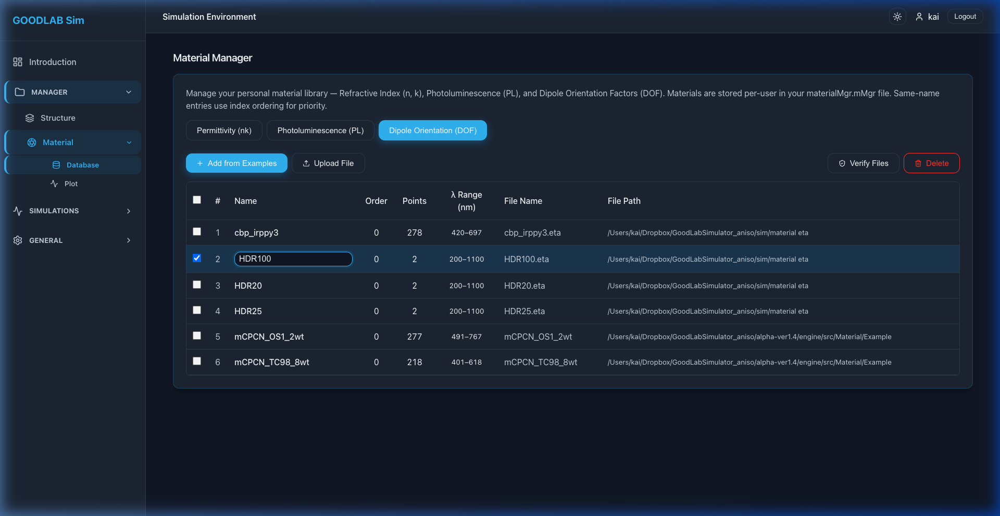
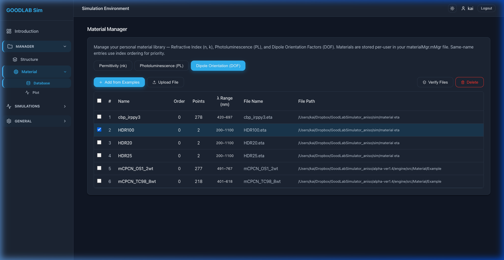

# GoodLabSimulator_aniso

[Back to portfolio](../../README.md)

GoodLabSimulator_aniso is a modernized web interface for a planar optics simulator. The project migrates a legacy desktop-style simulator into a React + FastAPI application with a material manager, user-specific sandboxing, optical-data visualization, and a suite of simulation forms.

## Portfolio Summary

| Item | Summary |
|---|---|
| Domain | Planar optics simulation and OLED material data management |
| Target users | Researchers working with optical constants, photoluminescence data, dipole orientation, and simulation parameter sets |
| Main value | Modernizes a legacy simulator into a browser UI with organized material libraries and isolated user workspaces |
| Stack | React, Vite, FastAPI, Python simulation engine, Recharts, file-based user state |
| Public-safe version | Local machine paths, detailed startup troubleshooting, and engine-specific debug notes were rewritten |

## What It Does

GoodLabSimulator_aniso organizes a planar optics workflow around:

- React frontend with dark mode, sidebar navigation, dynamic field tooltips, and simulation forms.
- FastAPI backend that receives structured simulation payloads.
- Python engine layer for legacy simulation algorithms.
- Material manager for permittivity, photoluminescence, and dipole-orientation datasets.
- User-specific settings and material libraries.
- Interactive plotting for optical constants and spectra.

## Material Manager

| Capability | Summary |
|---|---|
| Isolated libraries | Each user or guest can work with an independent material library |
| Material categories | Permittivity nk, photoluminescence PL, and dipole orientation DOF are separated into tabs |
| Examples library | Users can clone verified material examples into their workspace |
| Custom uploads | Users can add local material data files in formats expected by the simulator |
| Interactive plotting | Selected materials can be plotted and compared in the browser |
| Inline editing | Materials can be renamed and reordered from the table UI |

## Screenshots

| Rename | Reorder |
|---|---|
|  |  |

## Key Highlights

| Highlight | Why it matters |
|---|---|
| Legacy modernization | Moves a specialized simulator from a desktop-era workflow into a web application |
| User sandboxing | Separates user material libraries and settings to avoid cross-user contamination |
| Visual material inspection | Researchers can compare nk and PL curves before running simulations |
| Structured simulator forms | Multiple simulation workflows share consistent JSON payload handling |
| Guest architecture | Ephemeral guest usage can start from templates without persisting unwanted state |

## Vibe Coding Notes

This project is a good example of wrapping a legacy scientific engine with a modern web interface. The most useful work is around productizing research ergonomics: material browsing, examples import, inline renaming, drag-and-drop ordering, plotting, and user-state isolation.

## Public Version Adjustments

- Removed absolute local paths, machine-specific usernames, and raw troubleshooting details.
- Condensed legacy-engine integration notes into a portfolio-safe modernization summary.
- Copied only the Material Manager documentation images into `assets/`.

