# MyStocks

[Back to portfolio](../../README.md)

MyStocks is a local-first personal Taiwan stock portfolio manager. It imports the user's own trading records into a local SQLite ledger and turns that ledger into dashboards for holdings, realized/unrealized profit, dividends, annual returns, performance, volatility, and stock-level review.

All screenshots in this portfolio copy use synthetic demo data only.

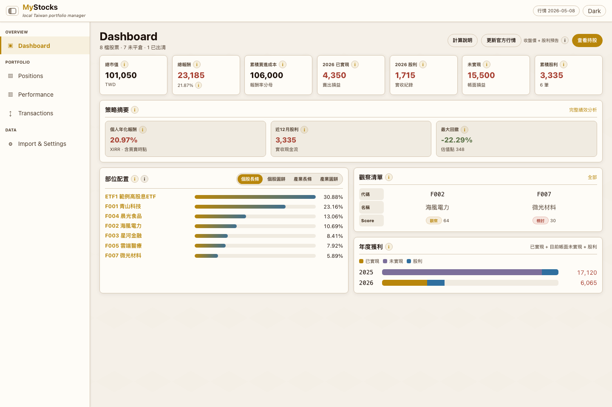

## Portfolio Summary

| Item | Summary |
|---|---|
| Domain | Personal finance analytics and Taiwan stock portfolio review |
| Target users | Individual investors who want private, local portfolio analytics |
| Main value | Converts a personal trading ledger into dashboards, drill-down pages, and explainable calculations |
| Stack | Flask, SQLite, Python analytics, TypeScript data contracts, JavaScript/React UI islands |
| Public-safe version | Private workbook names, data locations, backups, and operational commands were removed or generalized |

## What It Does

MyStocks helps answer practical portfolio questions:

- Current portfolio value and total return.
- Realized profit, unrealized profit, and dividend contribution.
- Portfolio concentration by stock and industry.
- Position review labels such as `Hold`, `Watch`, and `Review`.
- Performance indicators including XIRR, TWR, timing gap, drawdown, Sortino, volatility, and dividend quality.
- Stock-level drill-down with transactions, dividends, candlesticks, annual comparison, cost trace, and asset-value history.

## Screenshots

| Import & Settings | Calculation Help |
|---|---|
| 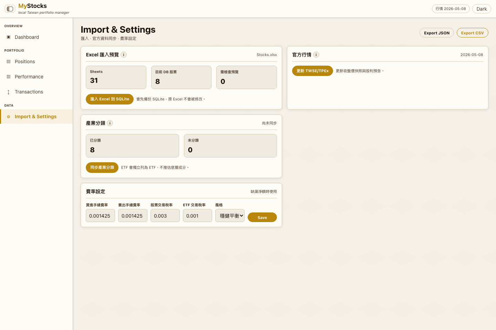 | 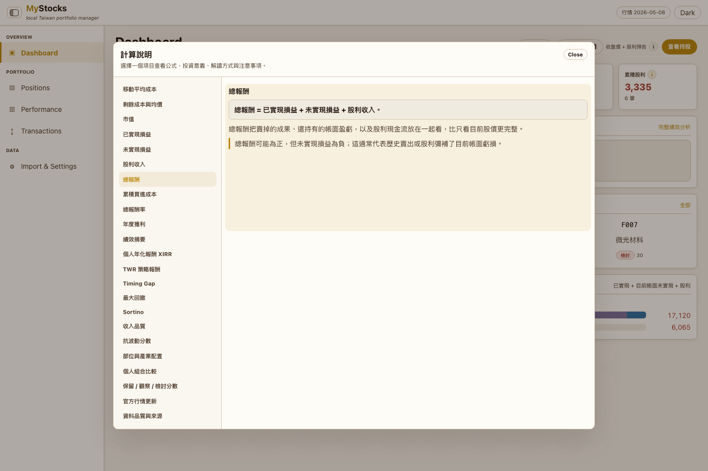 |

| Positions | Performance |
|---|---|
| 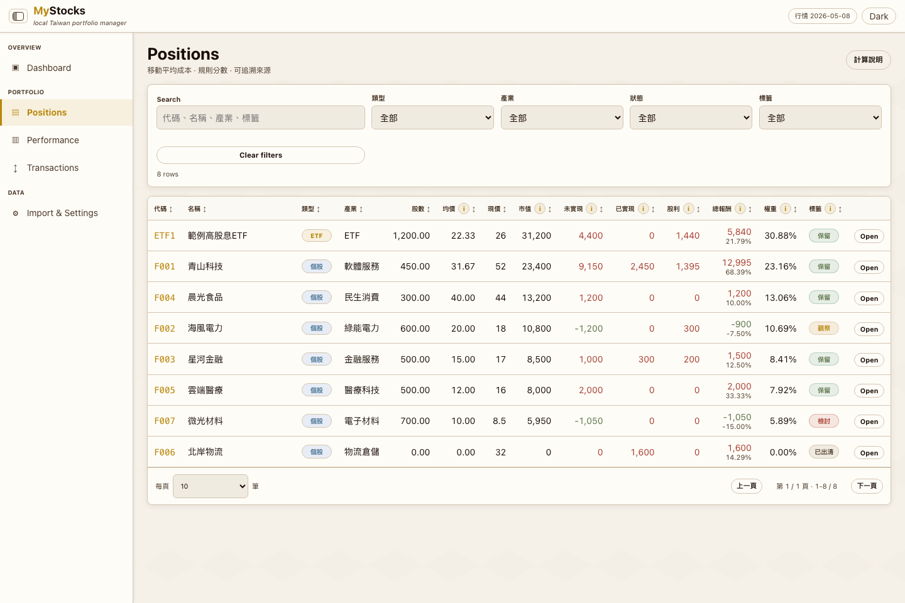 | 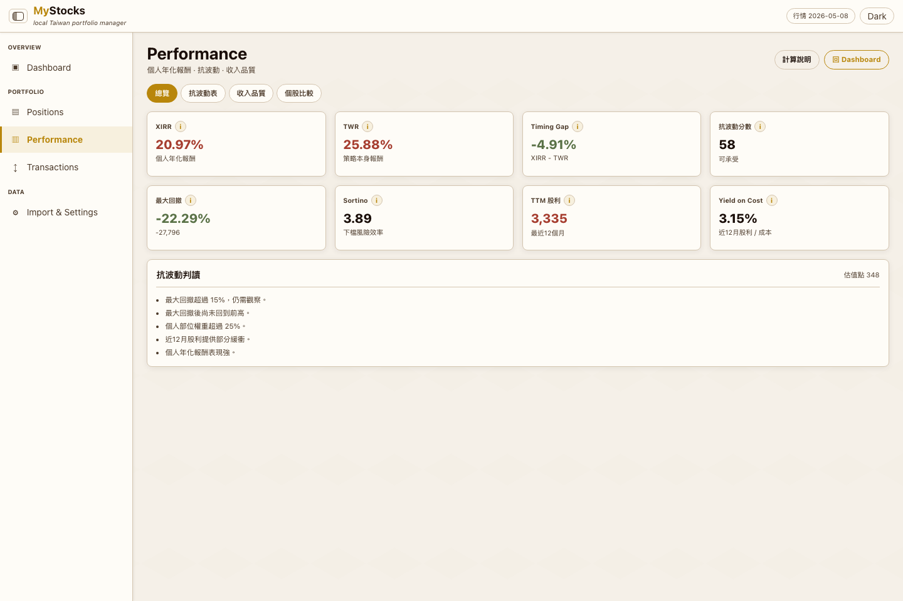 |

| Stock Detail | Stock Performance |
|---|---|
| 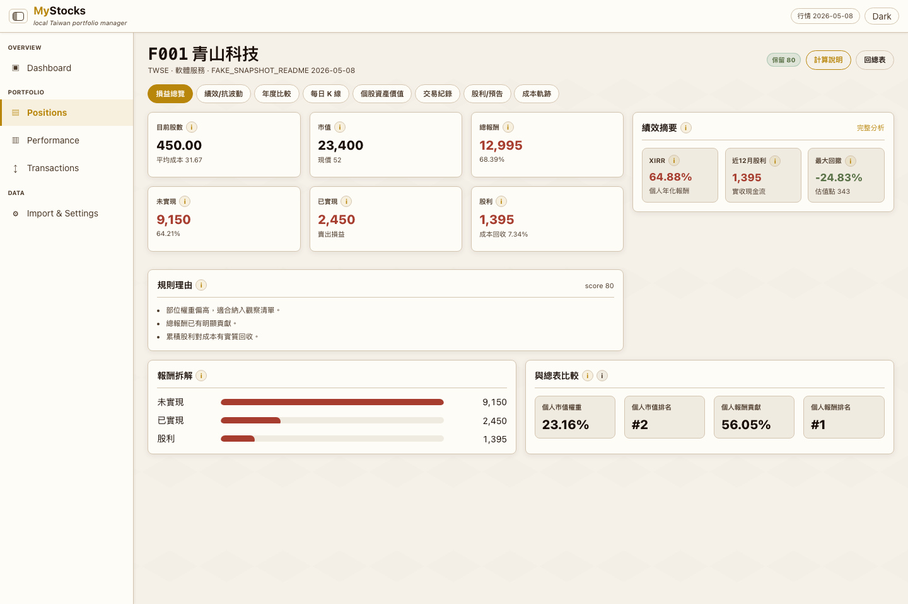 | 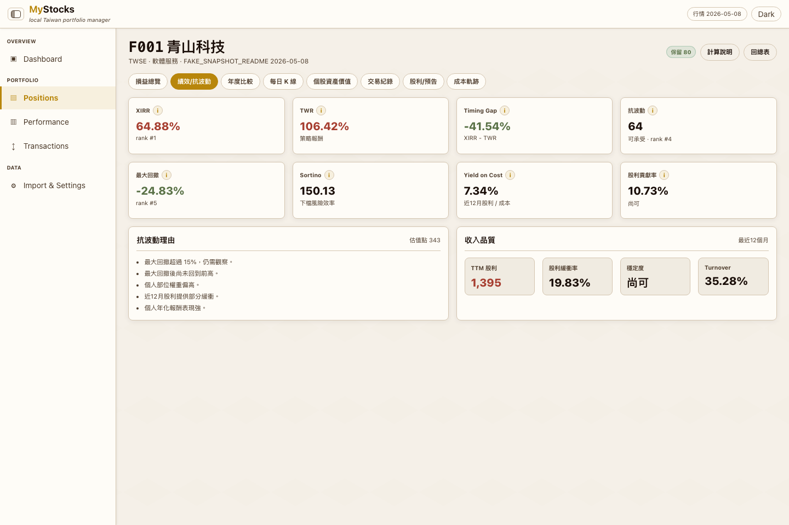 |

| Annual Comparison | Candlestick |
|---|---|
| 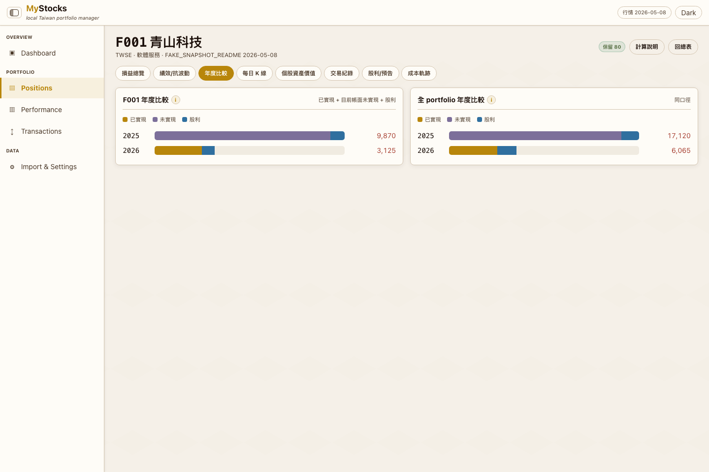 | 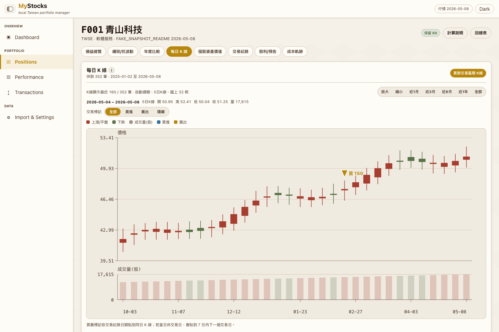 |

| Asset Value | Transactions |
|---|---|
| 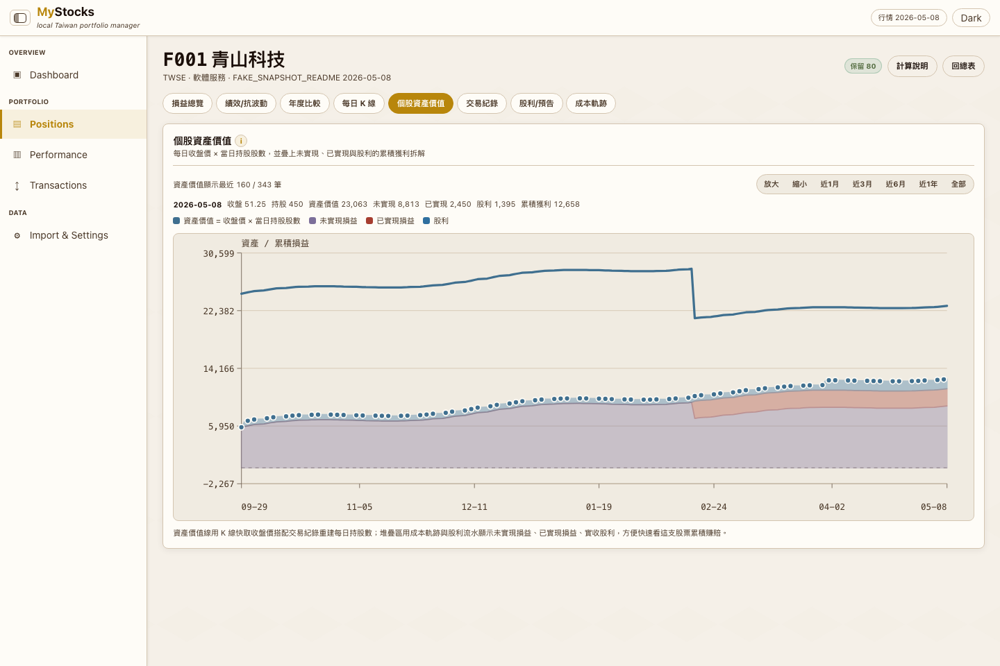 | 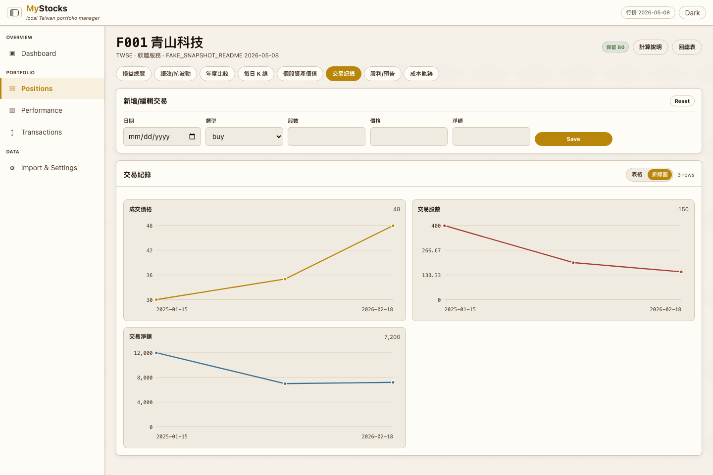 |

| Dividends | Cost Trace |
|---|---|
| 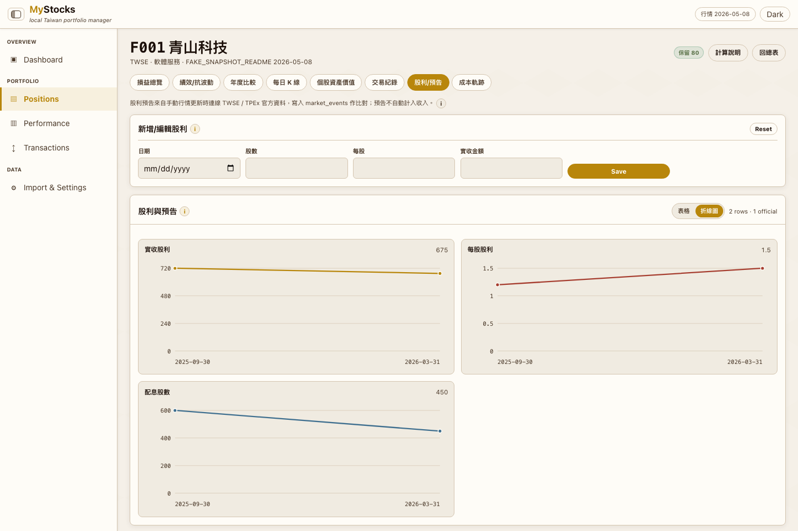 | 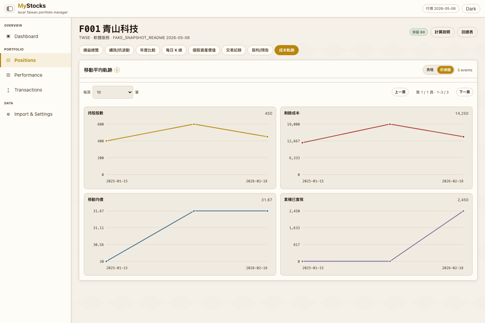 |

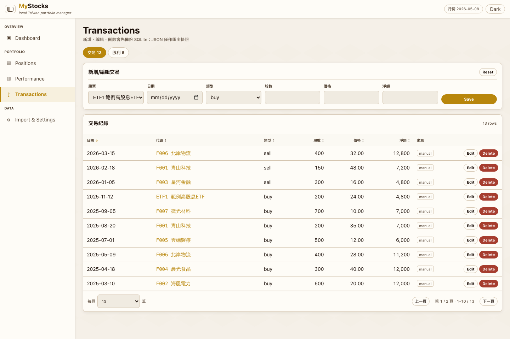

## Key Highlights

| Highlight | Why it matters |
|---|---|
| Local-first privacy | Real trading records, SQLite databases, exports, and backups are detached from git |
| Python as source of truth | Frontend displays analytics but does not recalculate profit independently |
| Rich portfolio views | Dashboard, holdings, performance, stock detail, transactions, and import settings cover the whole workflow |
| Explainable formulas | Calculation help explains cost, return, annual profit, decision score, and data-source assumptions |
| Official data refresh | Market data and dividend event previews are refreshed only when explicitly requested |

## Calculation Policy

The core formulas include moving-average cost, realized profit, unrealized profit, total return, annual realized/dividend/unrealized grouping, XIRR, TWR, max drawdown, and Sortino. Decision labels are review aids, not investment instructions.

## Vibe Coding Notes

MyStocks is a strong example of turning a messy personal spreadsheet workflow into a local product. The interesting part is the balance between privacy, domain-specific financial calculations, interactive charts, and bilingual UI behavior that matches Taiwan stock conventions.

## Public Version Adjustments

- Kept only fake demo screenshots and public-safe explanations.
- Removed private data paths, workbook details, backups, and operational commands.
- Preserved the original README's repeated privacy warning in condensed form.

