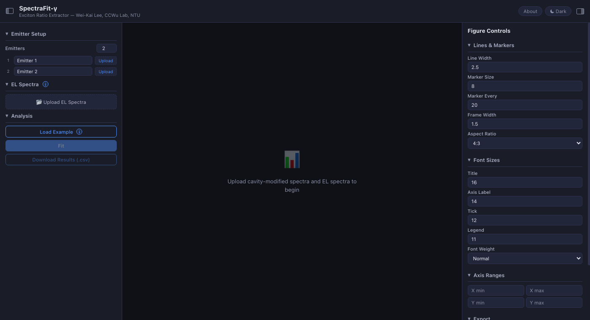
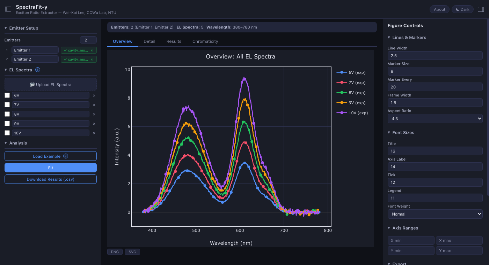
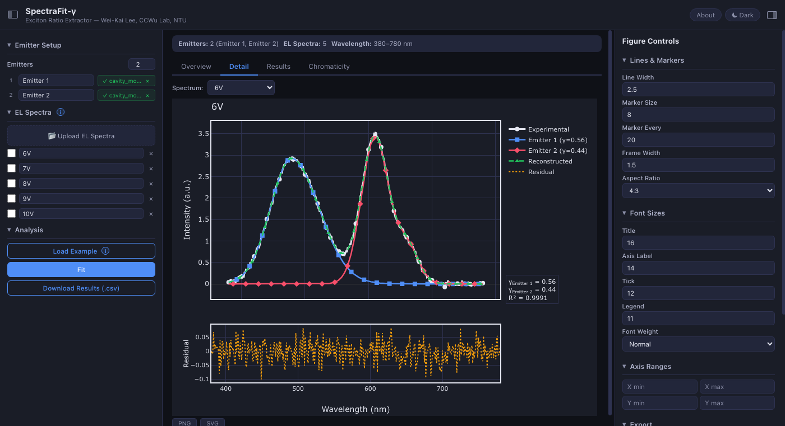
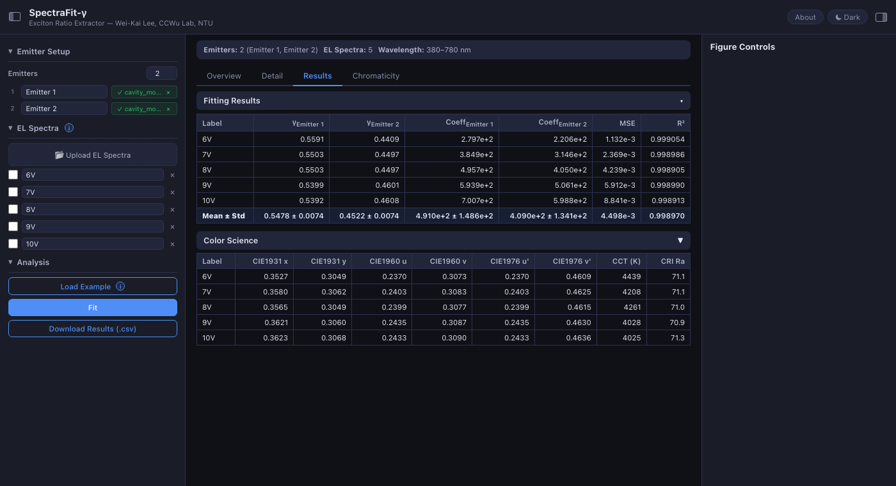
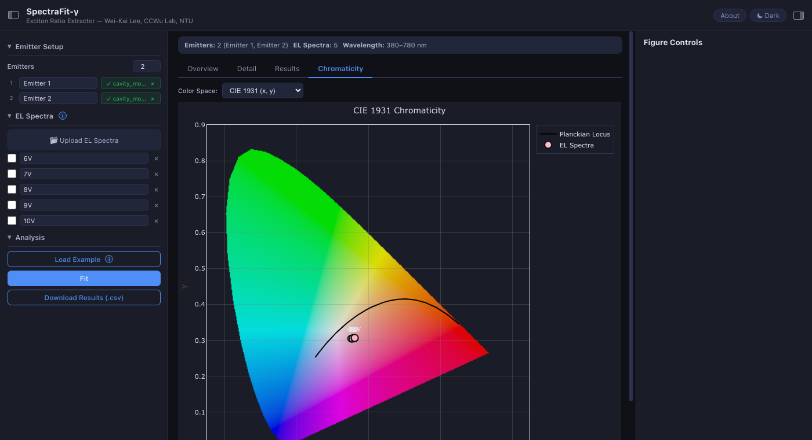

# SpectraFit-gamma

[Back to portfolio](../../README.md)

SpectraFit-gamma is an exciton-ratio extraction tool for white OLED electroluminescence spectra. It decomposes experimental EL spectra into individual emitter contributions by fitting against cavity-modified emitter spectra, then reports exciton partition ratios and color-science metrics.

## Portfolio Summary

| Item | Summary |
|---|---|
| Domain | OLED spectrum analysis and photophysics |
| Target users | Researchers studying multi-emitter white OLEDs |
| Main value | Fits EL spectra using cavity-modified spectra instead of raw intrinsic PL spectra |
| Stack | Flask, NumPy, openpyxl, Pillow, browser-based charts |
| Public-safe version | Installation commands and source layout details were omitted |

## Scientific Purpose

In white OLEDs with multiple emitters in one emitting layer, the device microcavity changes both spectral shape and intensity. Directly fitting total EL with intrinsic PL spectra can therefore be misleading.

SpectraFit-gamma fits the measured white EL spectrum as a weighted sum of precomputed cavity-modified spectra. The fitted coefficients are normalized into gamma values, representing each emitter's exciton partition fraction.

## What It Calculates

| Output | Meaning |
|---|---|
| gamma ratio | Fraction of total excitons assigned to each emitter |
| fitting coefficients | Contribution weights for cavity-modified emitter spectra |
| MSE and R-squared | Fit quality metrics |
| CIE 1931 / 1960 / 1976 | Color coordinates in multiple chromaticity spaces |
| CCT and CRI | Correlated color temperature and color rendering index |

## Screenshots

| Overview | Detail |
|---|---|
|  |  |

| Results | Chromaticity |
|---|---|
|  |  |

## Key Highlights

| Highlight | Why it matters |
|---|---|
| Multi-emitter fitting | Supports 2 to 6 emitters for white OLED decomposition |
| Batch analysis | Multiple EL spectra, such as bias-voltage series, can be fit in one session |
| Interactive detail view | Users can inspect per-spectrum decomposition and residuals |
| Chromaticity diagram | Color coordinates can be visualized in CIE spaces with gamut background |
| Exportable results | CSV output and PNG/SVG chart export support reporting workflows |

## Vibe Coding Notes

This project turns a specific photophysics analysis into a direct browser workflow. The core vibe-coding value is packaging a research equation path, batch input handling, fit diagnostics, and publication-friendly visualization into a tool a lab member can use without rebuilding analysis notebooks each time.

## Public Version Adjustments

- Kept the method, equations in prose, outputs, screenshots, and research context.
- Removed local setup commands and code-oriented structure.
- Included only the README screenshots under `assets/`.

