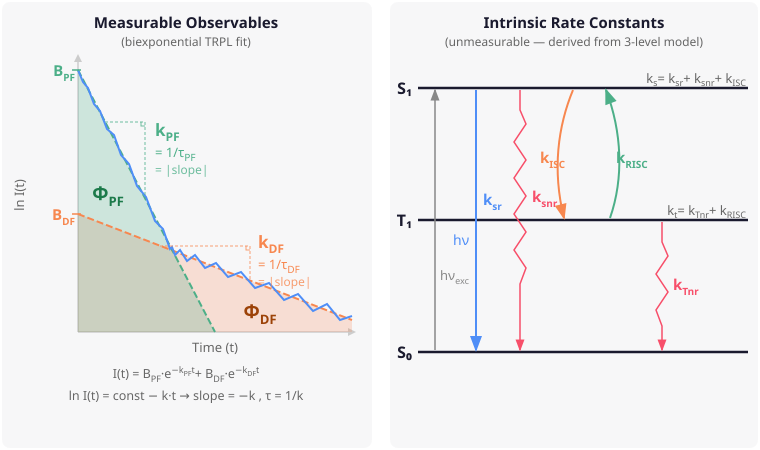
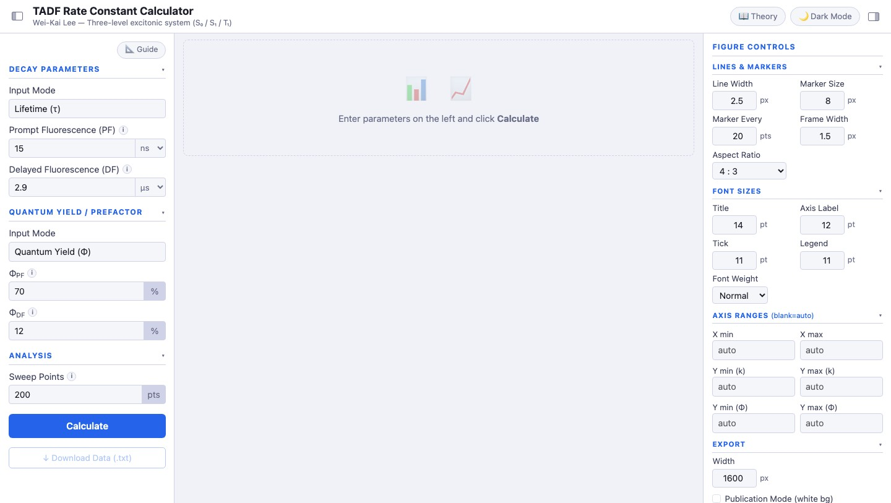
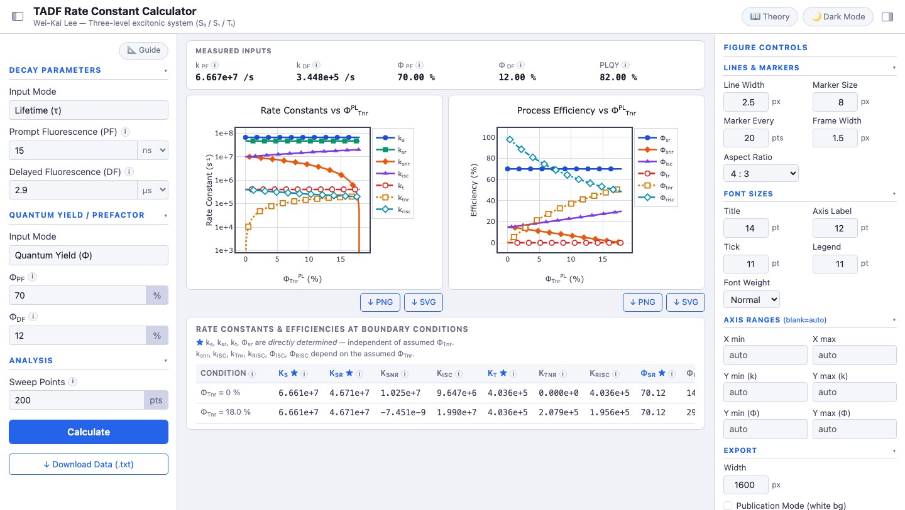
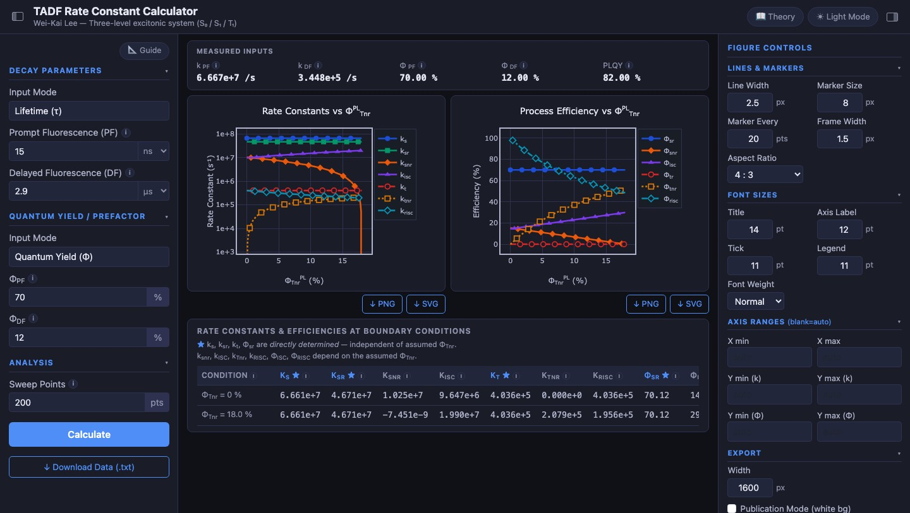

# TADF

[Back to portfolio](../../README.md)

TADF is an interactive rate-constant calculator for thermally activated delayed fluorescence emitters. It extracts intrinsic rate constants and process efficiencies from biexponential TRPL lifetimes and photoluminescence quantum yields.

## Portfolio Summary

| Item | Summary |
|---|---|
| Domain | OLED material photophysics and TADF rate analysis |
| Target users | Researchers analyzing TADF emitters from TRPL and PLQY measurements |
| Main value | Presents the full physically meaningful solution envelope instead of forcing a single underdetermined answer |
| Stack | Python, Flask, NumPy, browser-based interactive charts, optional macOS app bundle |
| Public-safe version | Source code examples, build commands, and local configuration snippets were removed |

## Scientific Model

The tool models a three-level excitonic system: S0, S1, and T1. Standard TRPL and PLQY measurements provide four measured quantities, while the intrinsic TADF model contains five rate constants. TADF resolves this underdetermination by sweeping the free triplet non-radiative loss fraction, Phi_Tnr.

The result is a curve of valid solutions over the allowed Phi_Tnr range. This is the scientifically honest output: a boundary-aware envelope rather than a false single-point estimate.

## What It Calculates

| Output group | Items |
|---|---|
| Singlet rates | k_s, k_sr, k_snr, k_isc |
| Triplet rates | k_t, k_tr, k_tnr, k_risc |
| Process efficiencies | Phi_sr, Phi_snr, Phi_isc, Phi_tr, Phi_tnr, Phi_risc |
| Boundary summary | Values at Phi_Tnr = 0 and Phi_Tnr = max |
| Export | Space-delimited data for downstream plotting or record keeping |

## Screenshots

| Input Panel | Results Light Mode |
|---|---|
|  |  |

## Key Highlights

| Highlight | Why it matters |
|---|---|
| TRPL + PLQY workflow | Maps common experimental observables into intrinsic model parameters |
| Phi_Tnr sweep | Makes the underdetermined degree of freedom visible and interpretable |
| Boundary table | Helps users understand physically meaningful extremes |
| Guide and theory panels | Explains what the measured decay slopes and quantum-yield areas mean |
| Figure controls | Supports publication-style chart export from the browser |

## Vibe Coding Notes

TADF is a compact example of converting a research calculation into an interactive teaching and analysis tool. The best part is the UI's refusal to hide uncertainty: rather than pretending there is one exact solution, it exposes the whole solution family.

## Public Version Adjustments

- Removed source-level Python API examples and build commands.
- Kept the scientific model, workflow, outputs, references context, and screenshots.
- Retained the public-facing research framing without including source files.

