# TMM-FBP

[Back to portfolio](../../README.md)

TMM-FBP, presented as Opti²Layer in the README, is a web-based optical thin-film design and optimization tool. It uses the Transfer Matrix Method with analytical gradients to design multilayer structures across targets such as anti-reflection coatings, mirrors, filters, beam splitters, and custom spectra.

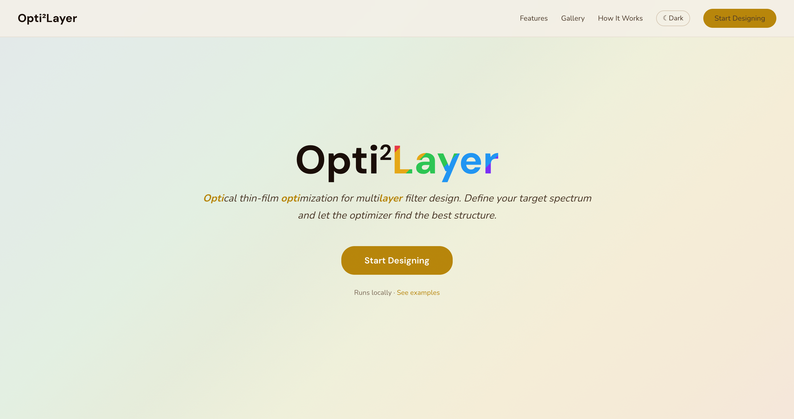

## Portfolio Summary

| Item | Summary |
|---|---|
| Domain | Optical thin-film simulation and inverse design |
| Target users | Researchers and engineers designing multilayer optical stacks |
| Main value | Combines TMM simulation, target-driven optimization, live convergence visualization, and exportable result figures |
| Stack | Flask, NumPy, SciPy, optional JAX backend, KaTeX, browser-based charts |
| Public-safe version | Source tree, install commands, and test details were summarized |

## What It Does

The app guides users through a full thin-film workflow:

| Section | Purpose |
|---|---|
| Structure | Choose templates or manually configure multilayer stacks |
| Simulation | Preview T/R/A spectrum across wavelength and angle ranges |
| Targets | Define one or more optimization objectives with live loss formula rendering |
| Optimize | Run live optimization with convergence and spectrum updates |
| Results | Inspect spectrum, thickness evolution, convergence, tables, animation, and metrics |

## Target Types

| Target | Use case |
|---|---|
| Anti-Reflection | Lens coatings and solar-cell interfaces |
| High-Reflection | DBR mirrors and laser-cavity structures |
| Edge Filter | Fluorescence and spectral filtering |
| Bandpass | UV/HEV blocking and passband design |
| Beam Splitter | Controlled T/R ratio design |
| Custom Spectrum | Arbitrary user-defined target spectrum |
| Variance Penalty | Smoothness and spectral uniformity constraints |
| Composite | Multi-objective optimization with weights |

## Screenshots

| Gallery | Structure |
|---|---|
| 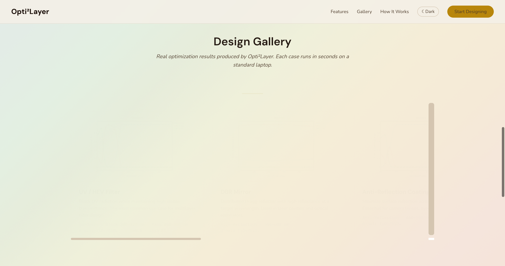 | 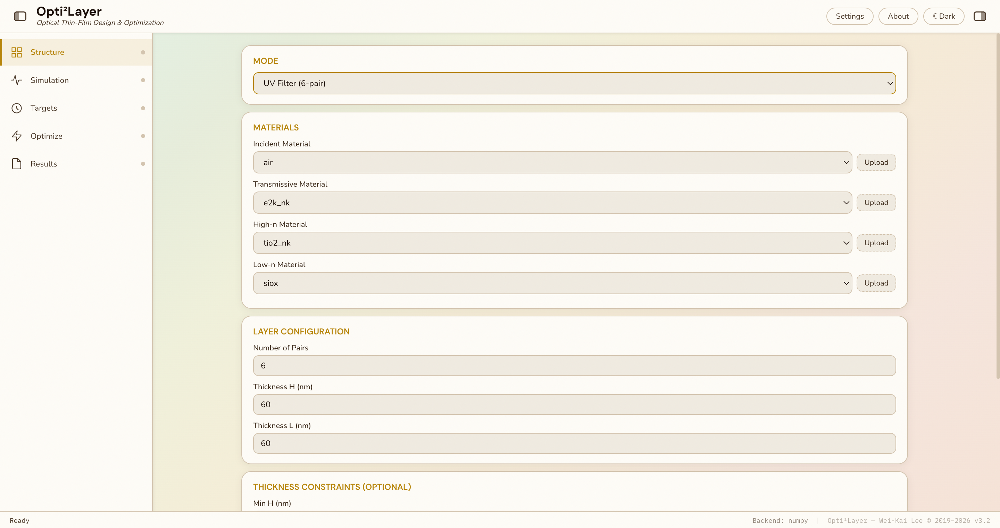 |

| Simulate | Targets |
|---|---|
| 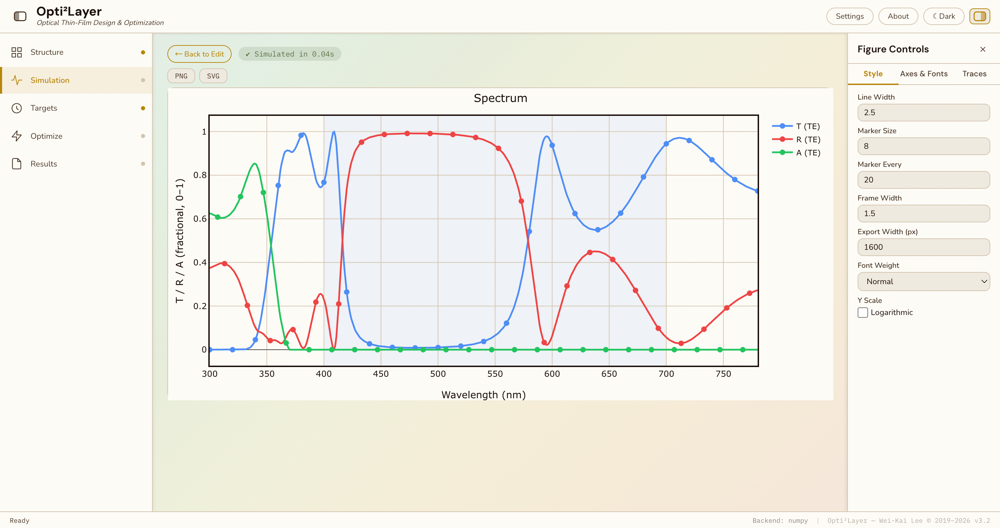 | 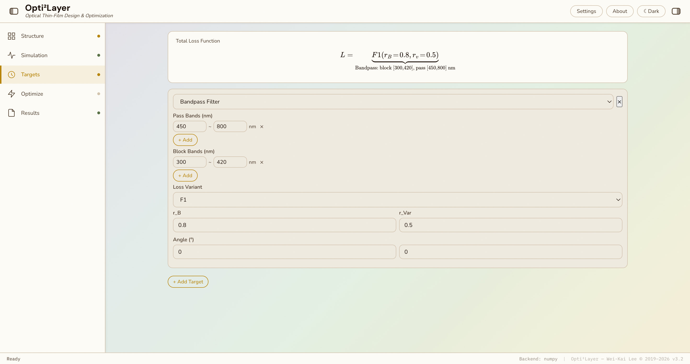 |

| Optimizing | Spectrum |
|---|---|
| 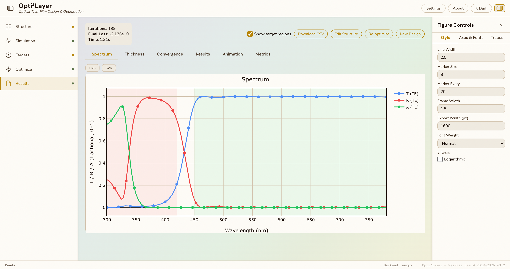 | 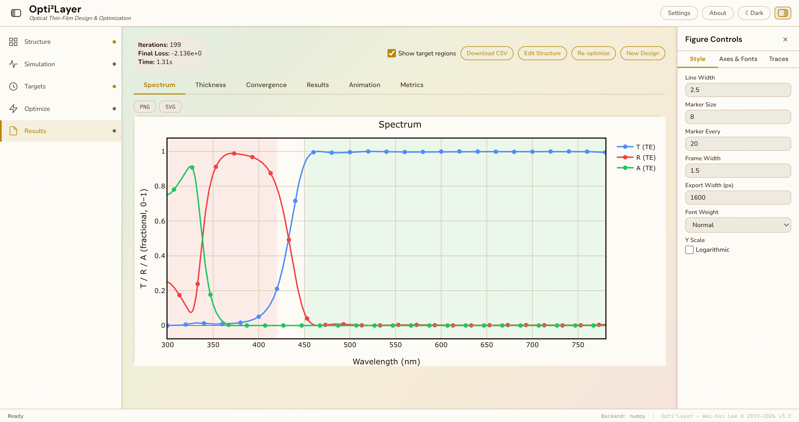 |

| Thickness | Convergence |
|---|---|
| 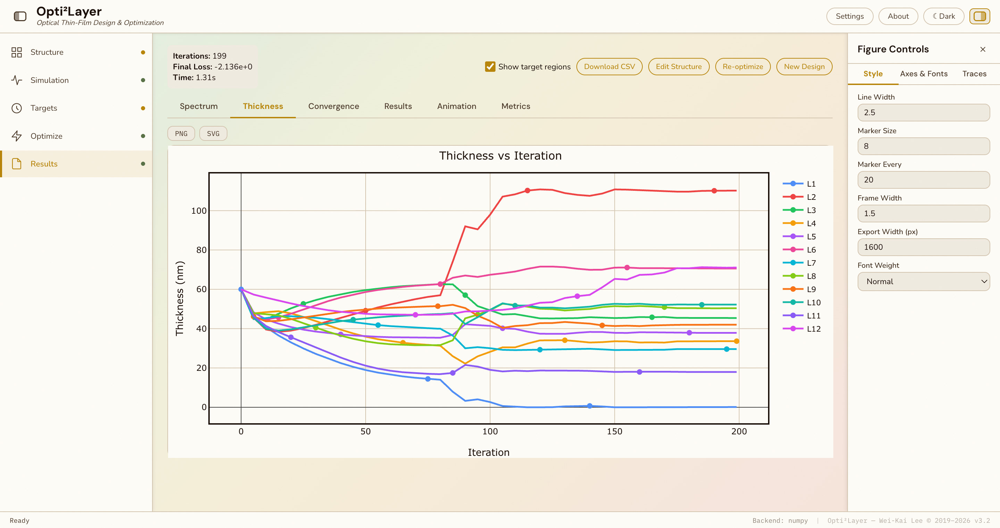 | 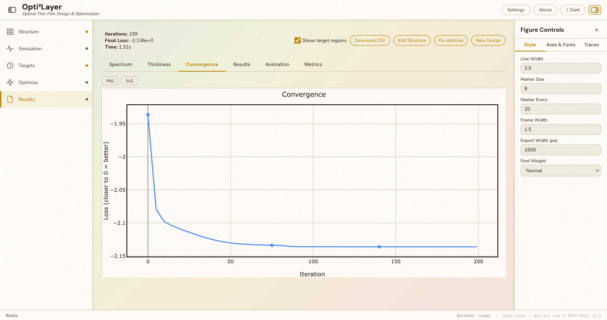 |

| Results | Metrics |
|---|---|
| 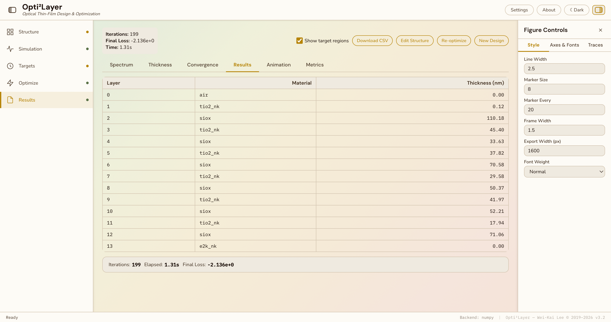 | 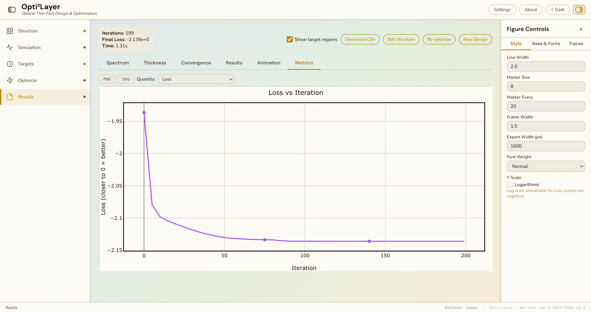 |

| Animation | Figure Controls |
|---|---|
| 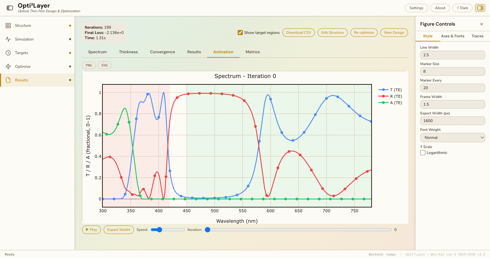 | 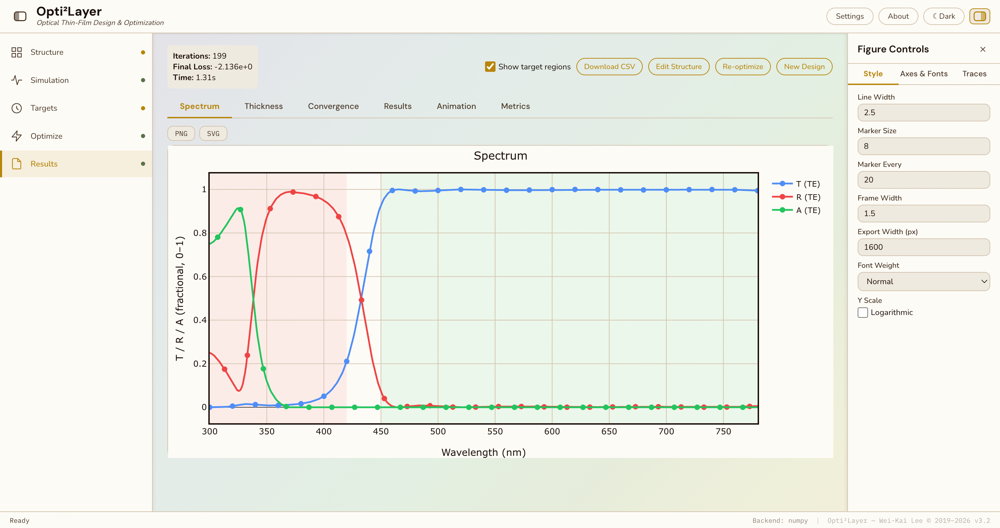 |

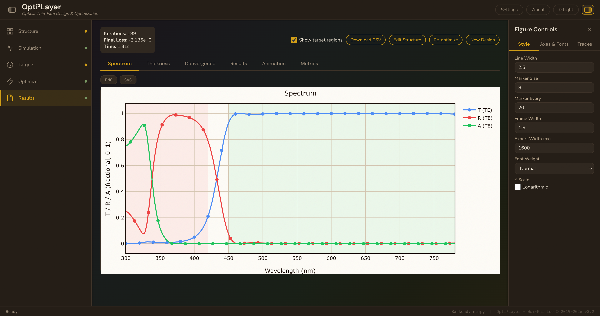

## Key Highlights

| Highlight | Why it matters |
|---|---|
| Analytical-gradient optimization | Supports faster inverse design than naive parameter sweeps |
| Thickness constraints | Uses bounded layer optimization so designs stay physically reasonable |
| Multi-target composite loss | Lets users combine practical optical objectives instead of optimizing one metric in isolation |
| Live updates | SSE-style progress makes optimization inspectable while it runs |
| Figure and animation export | Makes the tool useful for reports, demos, and design iteration records |

## Vibe Coding Notes

TMM-FBP is a mature example of upgrading a scientific computation kernel into a product-like design workbench. The original version history shows a progression from CLI-era TMM to a 2026 web GUI with gallery cases, composable targets, live optimization, and polished result controls.

## Public Version Adjustments

- Removed code layout and local run commands.
- Kept scientific target taxonomy, workflow, screenshots, and version-story context.
- Included only documentation screenshots under `assets/`.

