# calOLED

[Back to portfolio](../../README.md)

calOLED is a web-based OLED device characterization tool for converting raw electroluminescence spectra and I-V sweeps into device metrics such as EQE, brightness, CCT, color coordinates, current efficiency, power efficiency, and luminance efficiency.

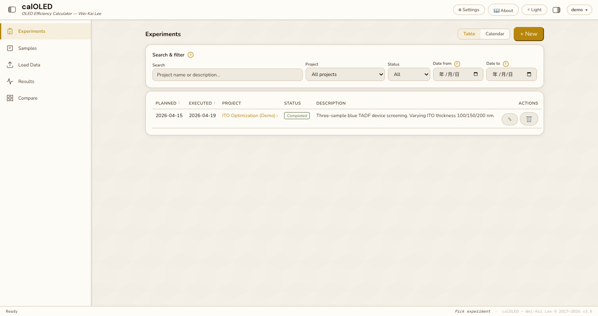

## Portfolio Summary

| Item | Summary |
|---|---|
| Domain | OLED device characterization and lab data analysis |
| Target users | OLED researchers, PhD students, postdocs, and fab-lab users |
| Main value | Replaces repeated spreadsheet workflows with a structured, auditable analysis system |
| Stack | Flask, SQLite, Plotly, responsive HTML/CSS/JS, Docker-oriented deployment |
| Public-safe version | Deployment details, admin operations, and sensitive runtime configuration were summarized |

## What It Does

calOLED turns raw OLED measurement data into experiment-level and sample-level analysis:

- EL spectrum upload and correction using calibration files.
- I-V sweep ingestion with dark current and photocurrent channels.
- EQE, brightness, CCT, Duv, CE, PE, LE, peak wavelength, and FWHM calculation.
- Experiment planning, sample structure tracking, planned/actual thickness, tooling factors, and fabrication metadata.
- Results tabs for EL, I-V, J-V, B-V, EQE-B, EQE-J, PE-B, and PE-J plots.
- Cross-sample and cross-experiment comparison with CSV export.
- Mobile UI for reviewing measurements while working near fabrication equipment.

## Screenshots

### Desktop

| Login | Samples |
|---|---|
| 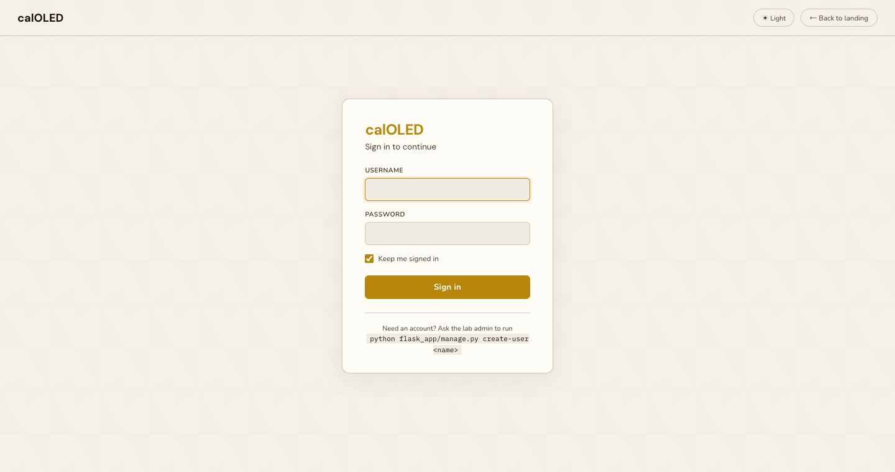 | 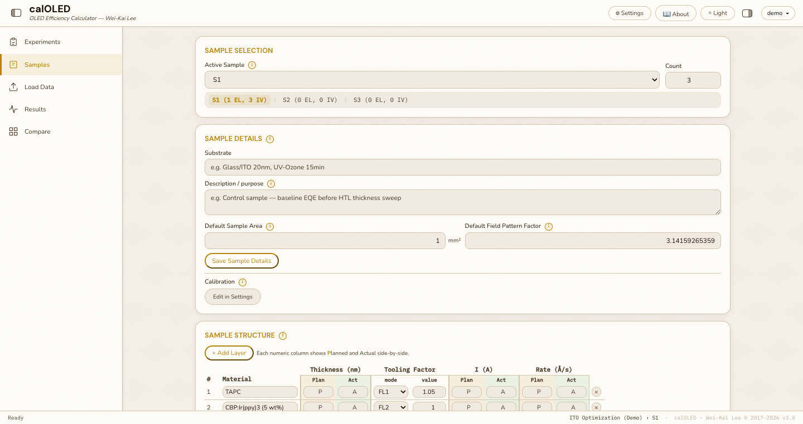 |

| Load Data | Results |
|---|---|
| 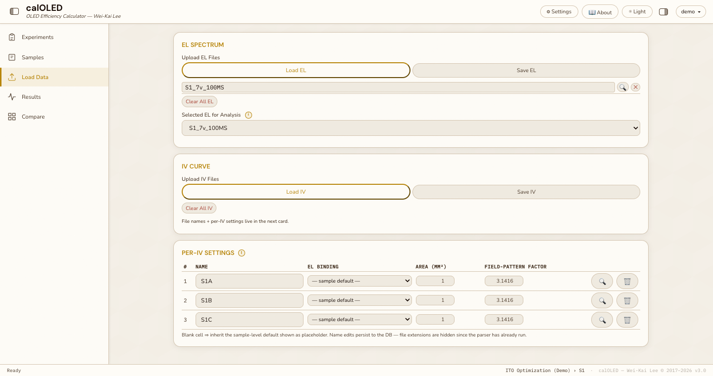 | 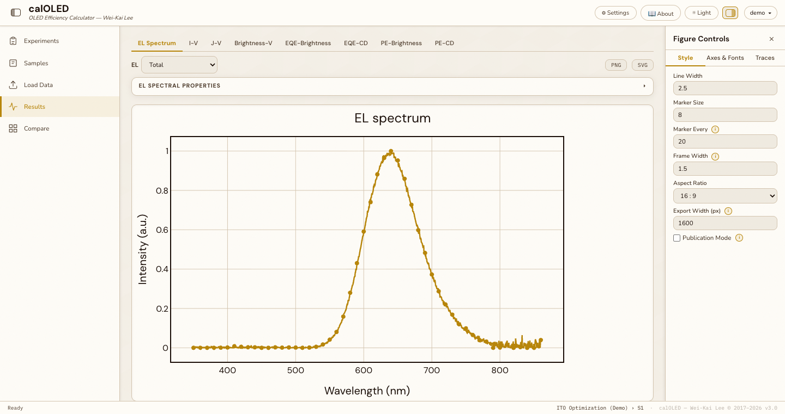 |

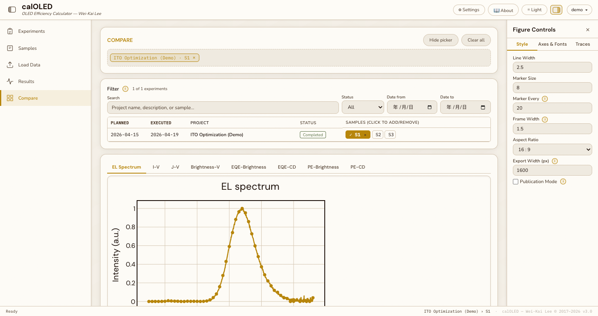

### Mobile

| Experiments | Samples | Sample Detail |
|---|---|---|
| 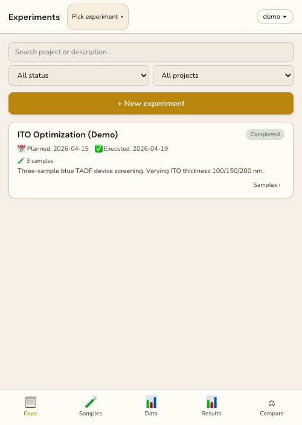 | 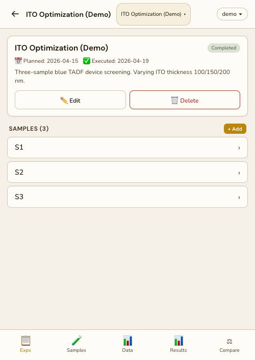 | 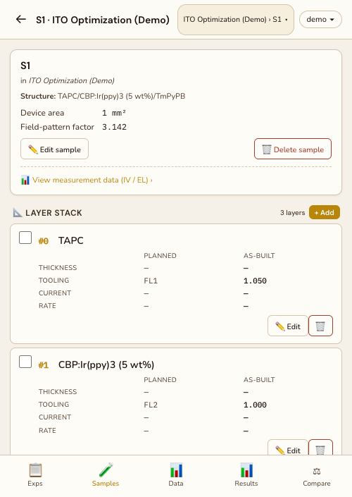 |

| Load | Results | Compare |
|---|---|---|
| 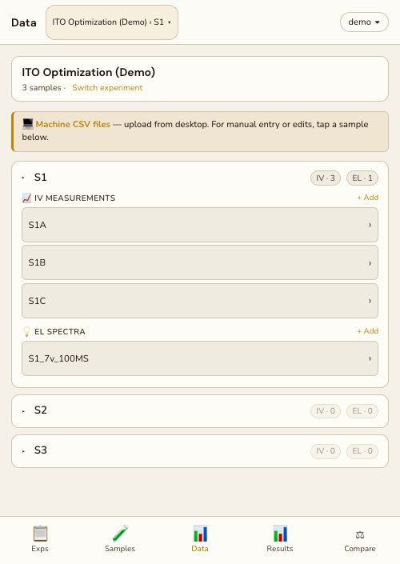 | 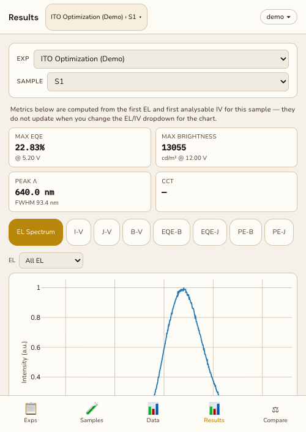 | 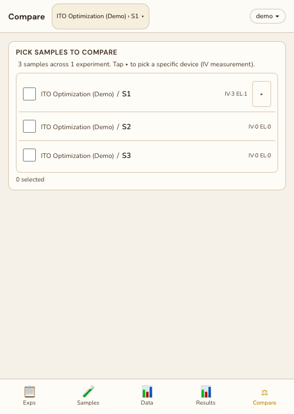 |

## Key Highlights

| Highlight | Why it matters |
|---|---|
| Calibration snapshots | Each experiment freezes the calibration state used at upload time, avoiding silent recalculation drift |
| Audit trail | Calibration changes are tracked as explicit events with stable fingerprints |
| Desktop/mobile parity | Researchers can measure on desktop and inspect results on a phone or tablet |
| Compare workflow | Multiple samples and IV sweeps can be overlaid and exported for paper-ready analysis |
| Security posture | Login, CSRF protection, upload allowlists, and non-root container deployment were considered in the original project |

## Vibe Coding Notes

This project shows a full lab-tool loop: data model, upload workflow, scientific computation, chart interaction, mobile ergonomics, calibration auditability, and deployment hardening. The original README documented a mature operational story; this portfolio version keeps the scientific and product value while reducing deployment-specific detail.

## Public Version Adjustments

- Removed command-heavy setup sections and private deployment assumptions.
- Kept the workflow, metric definitions, calibration model, and UI screenshots.
- Kept screenshots that were already documentation assets.

